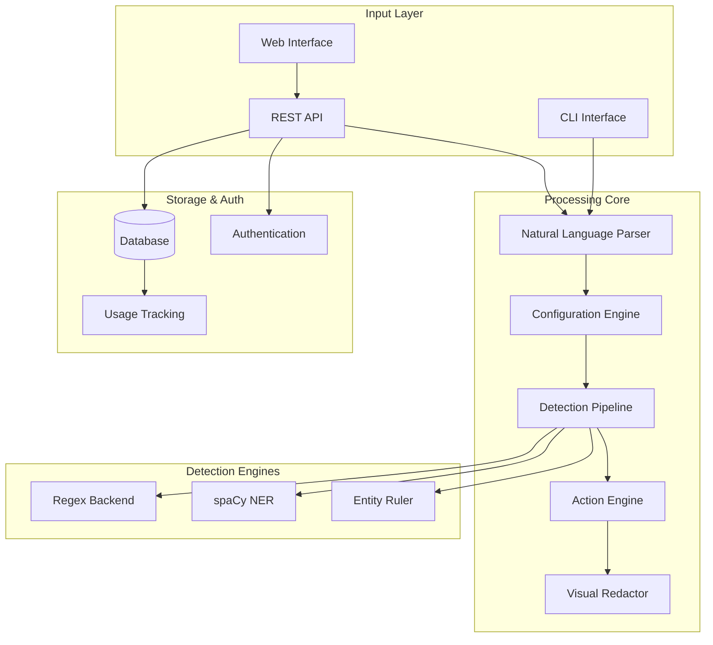
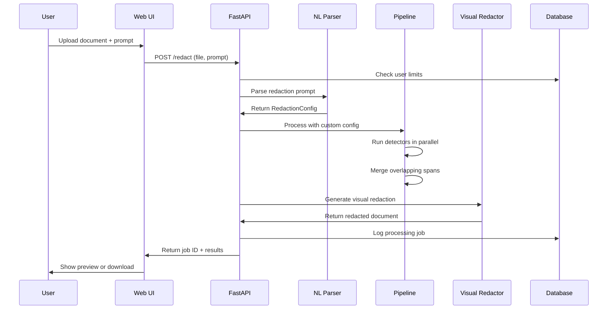

# Cloak Architecture Documentation

## System Overview

Cloak is a privacy-first document redaction platform built with a **modular, extensible architecture** that supports both CLI and web interfaces. The system is designed around a central pipeline that orchestrates multiple detection engines and applies policy-driven transformations.

## High-Level Architecture



## Web Application Flow



## Core Components Deep Dive

### 1. Detection Pipeline (`src/cloak/engine/pipeline.py`)

**Purpose**: Orchestrates multiple detection engines and merges results

**Key Features**:
- Runs multiple detectors in parallel
- Merges overlapping spans using priority rules
- Structured entities (EMAIL, SSN) win over unstructured (PERSON, ORG)
- Normalizes detector outputs to common `Span` format

**Data Flow**:
```
Input Text → [Regex, spaCy, Ruler] → Raw Spans → Merge & Filter → Final Spans
```

### 2. Detection Engines (`src/cloak/detect/`)

#### Regex Backend (`regex_backend.py`)
- Pattern-based detection for PII, secrets, network identifiers
- Configurable pattern packs: PII, secrets, network
- High-precision, rule-based approach

#### spaCy Backend (`spacy_backend.py`)
- NLP-based named entity recognition
- Uses pre-trained language models
- Handles context-dependent entities

#### Entity Ruler (`spacy_ruler.py`)
- Rule-based patterns for structured data
- Addresses, IDs, and formatted content
- Complements NER with explicit rules

### 3. Natural Language Parser (`src/cloak/nl/redaction_parser.py`)

**Purpose**: Converts user prompts to policy configurations

**Approach**: Keyword-based extraction (simple and reliable)
- Detects intent: exclude, include-only, or global redaction
- Maps natural language to entity types
- Handles complex prompts: "don't redact my name, only SSN and phone"

**Future**: LLM API integration with cost controls

### 4. Action Engine (`src/cloak/engine/actions.py`)

**Purpose**: Applies policy-driven transformations to detected spans

**Actions**:
- `mask`: Partial hiding (e.g., `a***@domain.com`)
- `drop`: Complete removal
- `hash`: Deterministic fingerprint  
- `pseudonymize`: Stable, readable aliases
- `none`: Keep original text

**Features**:
- Right-to-left replacement to preserve indices
- Referential integrity (same entity → same replacement)
- Per-entity type customization

### 5. Visual Redactor (`src/cloak/visual/redactor.py`)

**Purpose**: Creates documents with black boxes over sensitive content

**Current Support**:
- Text-to-image with matplotlib
- Black rectangle overlays
- Preview functionality with █ blocks

**Planned**:
- PDF coordinate-based redaction
- Image OCR + overlay
- Word document processing

### 6. Web API (`src/cloak/web/api.py`)

**Purpose**: REST endpoints for document processing and user management

**Key Endpoints**:
- `POST /redact`: Upload and process documents
- `GET /profile`: User info and usage limits
- `GET /jobs/{id}`: Processing status
- `GET /suggestions`: Example prompts

**Features**:
- File validation and size limits
- Natural language prompt integration
- Usage tracking and tier enforcement
- Secure file handling with auto-deletion

### 7. Database Layer (`src/cloak/web/database.py`)

**Models**:
- `User`: Authentication, tiers, usage tracking
- `ProcessingJob`: Job status and metadata  
- `UsageLog`: Aggregated usage statistics

**Features**:
- Tiered pricing support (Free/Paid/Enterprise)
- No sensitive content storage
- Usage limits and billing integration ready

## Configuration System

Cloak uses a **hierarchical configuration system** based on Pydantic:

```
CloakConfig
├── policy: Policy (actions per entity type, confidence thresholds)
└── detectors: Detectors  
    ├── regex: bool + regex_packs (pii, secrets, network)
    ├── spacy: SpacyConfig (model, min_confidence)
    ├── hf: HFConfig (transformers integration, disabled by default)
    └── spacy_ruler: EntityRulerConfig (structured pattern rules)
```

Configuration sources (priority order):
1. Natural language prompts (runtime)
2. Command-line arguments  
3. `.cloak.yaml` config file
4. Environment variables
5. Default values

## Data Privacy & Security

### Privacy-First Design
- **No Document Storage**: Files processed in memory, immediately deleted
- **Minimal Logging**: Only metadata, never content
- **User Control**: Explicit consent for all processing

### Security Measures
- **Input Validation**: File size, type, and content checks
- **Rate Limiting**: Per-user request throttling
- **Secure Headers**: CORS, CSP, and security headers
- **Token-based Auth**: JWT with secure refresh cycles

### Compliance Ready
- **GDPR**: Right to deletion, data portability
- **HIPAA**: PHI detection and secure handling
- **SOC 2**: Audit logs and access controls

## Testing Architecture

### Test Categories
1. **Unit Tests**: Individual component testing
2. **Integration Tests**: Pipeline workflow testing  
3. **API Tests**: Endpoint and authentication testing
4. **Visual Tests**: Redaction output validation

### Test Strategy
- **Mocked Dependencies**: Database, external services
- **Fixture-Based**: Reusable test data
- **Property-Based**: Edge case generation
- **Performance**: Load and stress testing

## Deployment Architecture

### Development
- **Local Development**: SQLite, file system storage
- **Testing**: In-memory database, mocked services
- **CI/CD**: GitHub Actions with full test suite

### Production (Planned)
- **Web Tier**: FastAPI with Gunicorn/Uvicorn
- **Database**: PostgreSQL with connection pooling
- **Storage**: Temporary file handling with auto-cleanup
- **Monitoring**: Structured logging, health checks
- **Security**: Rate limiting, authentication, HTTPS

## Scalability Considerations

### Current Limitations
- Synchronous processing (suitable for MVP)
- In-memory file handling (size limits)
- Single-instance deployment

### Future Scaling
- **Async Processing**: Background job queues
- **Horizontal Scaling**: Stateless API design
- **Caching**: Redis for session and rate limiting
- **CDN**: Static asset delivery
- **Microservices**: Service decomposition for enterprise

This architecture provides a solid foundation for the current MVP while enabling future growth and enterprise features.